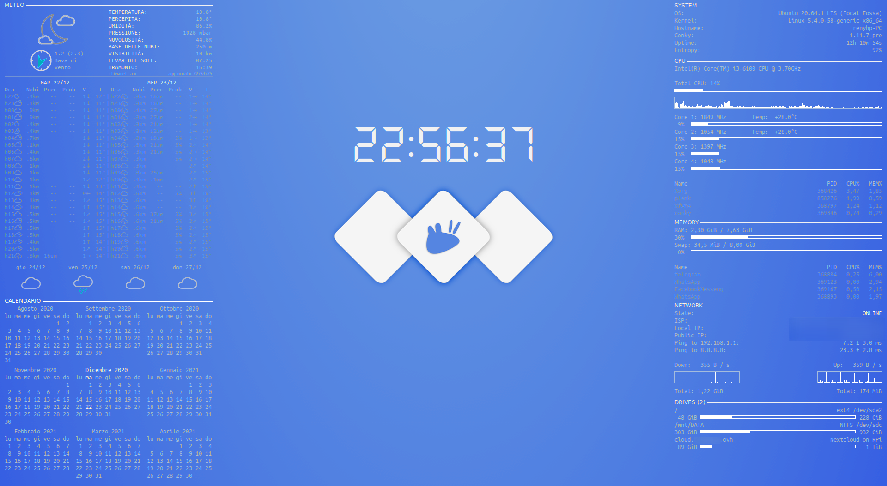

# My conky configuration

(Compared to this screenshot, I enlarged the network graphs)

## Install

* Copy the `.conky` folder in your home directory.
* Add `~/.conky/start.sh` to your startup applications
* Read below to adjust the configuration
* (Optionally) Set the wallpaper

## Acknowledgements (and caveats)

This was originally a copy of [mtking2's conky config](https://github.com/mtking2/conky-config), to which I made quite a bit of changes.

I am running Ubuntu on a desktop PC and this is tailored for my personal use - some scripts may need a bit of adjustments for other OSes or configurations. This repo is just meant to share my scripts, and not as a mantained ready-to-use config. I hope people can make use of it anyway.

### Weather

To make this work, you'll have to run `python3 -m venv ~/.conky/climacell/.env` and `pip install` some packages.

Currently I'm using [climacell.co](https://climacell.co) as an API provider. Be aware that my code uses the API v3, but it has been recently deprecated in favour of v4, and I'm not sure of if and when I will update my code (and this repo). (PR's are always welcome :-) ) I included some mock json's which I (very quickly) crafted and used while debugging.

PNG icons are taken from mtking2's accuweather scripts, which in turn, I believe, come from accuweather.

In the hourly forecast, I use [erikflower's weather icons](https://github.com/erikflowers/weather-icons/). You only need to install the ttf, which I symlinked.

Make sure you set your location and API key in [climacell.py](https://github.com/renyhp/conky-config/blob/main/.conky/climacell/climacell.py#L83-L85).

Obviously, unless you want this widget in italian, you'll have to translate a bit of strings :) By the way, wind is shown in [Beaufort scale](https://en.wikipedia.org/wiki/Beaufort_scale) which for me is much more intuitive than any other unit.

### Clock

The font I'm using is a custom version of [DS-Digital](https://www.dafont.com/ds-digital.font), which I tweaked in order to make the 1's as spaced as the other digits, and to make the colon look like the way you see in the screenshot.

In my understanding, licenses and copyrights don't make me able to share this font. If you don't want to fiddle with the ttf, you can just substitute the font with DS-Digital.

### Network

This works nicely because I'm on a desktop PC and it only monitors the ethernet connection. If you're on a laptop, you may want to tweak it to use the WiFi connection and maybe show different info, e.g. SSID name, WiFi quality, etc. (much like the original mtking2's config; such variables are included in conky, so it is very easy to add them.)

### Drives

I have a Raspberry Pi with a Nextcloud instance: as you can see from the screenshot, my actual disks.sh script also includes some lines that fetch the disk usage on the RPi and displays it as an additional disk. I removed these lines because I think they are too specific for my case, but I can share them if anyone asks me.

### Wallpaper

The original wallpaper is [here](https://www.xfce-look.org/c/1341338), together with some other variants and colors. This version is a custom one which I adjusted in order to match the [Arc theme](https://github.com/jnsh/arc-theme) color.
